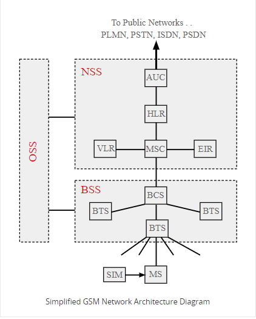

# TeleCommunacation(Mobile Communacation)

## Gobal System of Mobile Communication

## Table of Conatent :

 [What Is GSM?](#what-is-gsm?)

 [History of GSM](#history-of-gsm)
  
  [Key GSM History Dates & Mileston ](#key-gsm-history-dates--mileston)

[GSM Network Architecture](#gsm-network-architecture)  

  [Network and Switching Subsystem ](#network-and-switching-subsystem-nss)

  [Base Station Subsystem](#base-station-subsystem-bss)
  
  [Mobile station](#mobile-station)

  [Operation and Support Subsystem ](#operation-and-support-subsystem-oss)

[GSM In Bangladesh](#gsm-in-bangladesh) 

[GSM Services]

 ## What Is GSM?

Basically Mobile System(MS) has to Netwrok 1.GSM. 2.CDMA(code-division multiple access)

 GSM is mobile network that mostly used by the mobile user of the Europian country. It's a evolution of the wireless  mobile telecommunaction that include(HSCSD,GPRS,EDGE,UMTS)
  
  1.HSCSD=High-Speed Circuit-Switched Data

  2.GPRS=General Packet Radio Service

  3.EDGE= Enhanced Data GSM Environment

  4.UMTS= Universal Mobile Telecommunications Service

## History of GSM 

GSM Include the advance mobile phone system in USA and total access communacation system in UK ,were they built with analog technology. But those system are not unable to adoption of more user so they need more efficent cellular technology that could be used by internatinally. Then, in 1983 CEPT decided on several criteria that the new system must meet: international roaming support, high speech quality, support for handheld devices, low service cost, support for new services and Integrated Services Digital Network (ISDN) capability.

In 1987, representatives from 13 European countries signed a contract to deploy a telecommunications standard. The European Union (EU) then passed laws to require GSM as a standard in Europe. In 1989, the responsibility of the GSM project was transferred from CEPT to the European Telecommunications Standards Institute (ETSI).

### Key GSM History Dates & Mileston

| YEARS | MILESTONE |
| ------------ | ------------ |
|  1982    | Groupe Speciale Mobile established by to develop the pan-European cellular mobile system standards.       |
| 1985      |Basic list of recommendations to be generated by the group was adopted.| 
| 1986   |Field tests undertaken to prove which techniques should be adopted for the new system|
| 1987   |	TDMA approach adopted as the main access method for GSm. Frequency division is also used between channels, but time division each individual frequency channel.| 
| 1988     |GSM system validation undertaken        |
| 1989  |  	ETSI, European telecommunications Standards Institute takes on responsibility for managing the GSM standards.        |
|  1990       |	Phase 1 of the GSM specifications released.          |
| 1991      |  Commercial launch of the GSM service        |
| 1993    |  Coverage of main roads GSM services start outside Europe        |
| 1995   | Phase 2 of the GSM specifications released         |
| 2004      | GSM subscriptions reach 1 billion. Announcement made at 3GSM in Cannes         |
| Sorce:        |https://www.electronics-notes.com/articles/history/cellphone-history/gsm-history-groupe-special-mobile.php          |

## GSM Network Architecture
 
 

 In order that the GSM system operates together as a complete system, the overall network architecture brings together a series of data network identities, each with several elements.

The GSM network architecture is defined in the GSM specifications and it can be grouped into four main areas:

1.Network and Switching Subsystem (NSS)

2.Base-Station Subsystem (BSS)

3.Mobile station (MS)

4.Operation and Support Subsystem (OSS)

 ### Network and Switching Subsystem (NSS)
   Mobile Services Switching Centre (MSC):The main element within the core network area of the overall GSM network architecture is the Mobile switching Services Centre (MSC). The MSC acts like a normal switching node within a PSTN or ISDN, but also provides additional functionality to enable the requirements of a mobile user to be supported.

   Home Location Register (HLR): It's indicated an user home location that help GSM network is able to route calls to the relevant base station for the MS.(If an user buy an sim from dhaka and register it from here that's mean this ms home location is dhaka.)

  Visitor Location Register (VLR): A visitor location register (VLR) is a server in a cellular network that supports roaming functions for users outside the coverage area of their own HLR. The VLR uses Signaling System 7 to obtain information about the user from the HLR, and then establishes a temporary record on the VLR while the user is within the VLR coverage area, ensuring mobility management and call-handling functions.

  Equipment Identity Register (EIR): The Equipment Identity Register (EIR) is a database that contains a record of the all the mobile stations (MS)that are allowed in a network as well as an database of all equipment that is banned, e.g. because it is lost or stolen.

  The identity of the mobile station is given by the International Mobile Equipment Identity (IMEI). Each time a call is made, the MSC requests the IMEI of the mobile station, which is then send to the EIR for authorisation.

  IMEI have three part like
   
   1.White IMIE(Valid)

   2.Gray IMIE(In Obsarbation)

   3.Balck IMIE(Invalid)

  Authentication Centre (AuC):   The AuC is a protected database that contains the secret key also contained in the user's SIM card. It is used for authentication and for ciphering on the radio channe

### Base Station Subsystem (BSS)     

  Base Transceiver Station (BTS): The BTS used in a GSM network comprises the radio transmitter receivers, and their associated antennas that transmit and receive to directly communicate with the mobiles. The BTS is the defining element for each cell. The BTS communicates with the mobiles and the interface between the two is known as the Um interface with its associated protocols.

  Base Station Controller (BSC):   The BSC forms the next stage back into the GSM network. It controls a group of BTSs, and is often co-located with one of the BTSs in its group. It manages the radio resources and controls items such as handover within the group of BTSs, allocates channels and the like. It communicates with the BTSs over what is termed the Abis interface.

### Mobile station 
   
    The MS consists of the physical equipment, such as the radio transceiver, display and digital signal processors, and the SIM card. It provides the air interface to the user in GSM networks. As such, other services are also provided, which include:

   Voice teleservices

   Data bearer services

   The features' supplementary services

### Operation and Support Subsystem (OSS)

   Operations and maintenance center (OMC) is related to all equipment in the switching system and to the BSC. The process of implementation of OMC is called the operation and support system (OSS).

   Below are some of the OMC functions:

   Administration and commercial operation (subscription, end terminals, charging and statistics).

   Security Management.

   Network configuration, Operation and Performance Management.

   Maintenance Tasks.

## GSM In Bangladesh

### The Providers
  Among the six mobile phone companies in Bangladesh, five of them are using

  the GSM technology. The companies are:

   1. GrameenPhone Ltd.
 
   3. Sheba Telecom (Pvt.) Ltd. (Banglalink)

   4. Teletalk Bangladesh Ltd
   
   5. Robi Axiata Limited (Robi) 
   
   6. Robi Axiata Limited (Airtel) 
   
 #### GrameenPhone
 Network Information:

 Operator Name: GrameenPhone Ltd

 Network Name: Grameenphone

 Technology: GSM 900

 Network Status: Live March 1997

 Web Site: grameenphone.com

 #### Banglalink
  Network Information:

 Operator Name: Sheba Telecom (Pvt.) Ltd.

 Network Name: Banglalink

 Technology: GSM 900

 Network Status: Live September 1998

 Web Site: https://www.banglalink.net/en

#### Robi
 Network Information:

 Operator Name: Robi Axiata Limited (Robi)

 Network Name: Robi

 Technology: GSM 900

 Network Status: Live September 1998 (as Robi 2016)

 Web Site: https://www.robi.com.bd/en

#### Airtel
 Network Information:

 Operator Name: Robi Axiata Limited (Airtel)

 Network Name: Airtel

 Technology: GSM 900

 Network Status: Live January 28, 2016 (as Airtel)

 Web Site: https://www.bd.airtel.com/en

#### Teletalk
 Network Information:

 Operator Name:TelecommunicationBD

 Network Name: Teletalk

 Technology: GSM 900

 Network Status: Live 26 December 2004

 Web Site: http://www.teletalk.com.bd/

## GSM Services

   1.Bearer Services

   2.Tele Services

   3.Supplementaray Services

   Bearer Services: Data services or Bearer Services are used through a GSM phone. to receive and send data is the essential building block leading to widespread mobile Internet access and mobile data transfer. GSM currently has a data transfer rate of 9.6k. New developments that will push up data transfer rates for GSM users are HSCSD (high speed circuit switched data) and GPRS (general packet radio service) are now available.

   Tele Services:The abilities of a Bearer Service are used by a Teleservice to transport data.
   
    These services are further transited in the following ways:

    2.1-Voice Calls

    2.2-Videotext and Facsmile

    2.3-Short Text Messages

   Supplementaray Services:Supplementary services are additional services that are provided in addition to teleservices and bearer services. These services include caller identification, call forwarding, call waiting, multi-party conversations, and barring of outgoing (international) calls, among others

     These services are further transited in the following ways:
       
       3.1-Conferencing

       3.2-Call Waiting 

       3.3-Call Hold

       3.4-Call Forwarding

       3.5-Call Barring 

       3.6-Number Identification
         
         3.6.1-Calling Line Identification Presentation

         3.6.2-Calling Line Identification Restriction

         3.6.3-Connected Line Identification Presentation 

         3.6.4-Connected Line Identification Restriction

         3.6.5-Malicious Call Identification

       3.7-Advice of Charge (AoC)
       
       3.8-Unstructured supplementary services data (USSD) 
       

